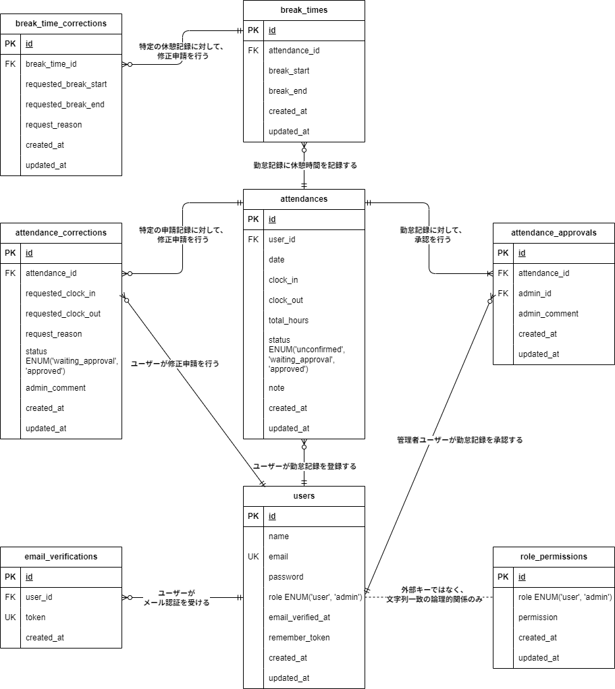

## アプリケーション名
模擬案件：勤怠管理アプリ  

---

## ER図
下記は本アプリケーションで使用しているテーブルとリレーションを表したER図です。  

---

## プロジェクト概要
本プロジェクトは、Laravelを使用した勤怠管理アプリの開発を目的としています。  
以下の機能を提供します。  

---

## 主な機能
- **一般ユーザー向け機能**
  - 勤怠打刻：出勤・退勤・休憩の打刻が可能  
  - 勤怠一覧確認：自身の勤怠記録を一覧表示  
  - 勤怠詳細確認：打刻の詳細情報を確認  
  - 修正申請：勤怠データの修正を申請可能  
  - 申請履歴確認：自身の修正申請の承認ステータスを確認  
- **管理者向け機能**
  - 勤怠データ管理：全スタッフの勤怠情報を一覧で確認  
  - スタッフ別勤怠管理：特定スタッフの勤怠詳細を閲覧  
  - 修正申請の承認：スタッフの修正申請を承認  
  - スタッフ管理：登録されているスタッフ情報の管理  
  - レポート出力：勤怠データをCSV形式でエクスポート  
- **共通機能**
  - 一般ユーザー・管理者ごとにログイン認証  
  - メールアドレス・パスワードの入力による認証  
  - Mailtrapによるメール認証（登録時にメールを送信し、認証を完了させる）  
  - フォーム未入力時のバリデーションメッセージ  
  - 修正申請の入力チェック（不正な値の入力を防止）  
---

## 必要な環境
- **PHP**: バージョン 7.3 以上
- **Laravel**: バージョン 8.75
- **Composer**: バージョン 2.0 以上
- **MySQL**: バージョン 8.0 以上
- **Docker**: バージョン 27.2.0 以上
- **Docker Compose**: バージョン 2.0 以上
- **Mailtrap**: APIバージョン 2.0 以上
  - メール送信を開発環境で確認するためのツール
---

## デフォルトのデータベース設定
`docker-compose.yml` で設定されているデータベースの初期情報は以下の通りです。  
デフォルトのパスワードをそのまま本番環境で使用しないでください。

- データベース名: `laravel_db`
- ユーザー名: `laravel_user`
- パスワード: `laravel_pass`
- MySQLのルートパスワード: `root`

---

## セットアップ方法
1.リポジトリをクローンする
   リポジトリを GitHub からローカルにコピーします。  

     git clone https://github.com/shimodum/mockcase-attendance.git

   **クローン後、プロジェクトディレクトリに移動します**:  

      cd mockcase-attendance
   
2.Docker コンテナを起動する  
 　 Docker Compose を使用して必要なサービスを立ち上げます。  
 　 初回起動や Dockerfile に変更があった場合には、以下のコマンドを実行してコンテナをビルドし直します。

    docker-compose up -d --build
   
3.依存関係をインストールする  
 　 PHP コンテナ内で Composer を使ってライブラリをインストールします。

    docker-compose exec php composer install
 
4.環境変数を設定する  
　 環境設定ファイル .env.example を .env にコピーし、アプリケーションの秘密鍵を生成します。

     cp .env.example .env  
     php artisan key:generate

5.データベースをマイグレートする  
 　 アプリケーションで使用するデータベースのテーブルを作成します。
   
    php artisan migrate
   
  **開発者向け情報**  
   phpMyAdmin を使用してデータベースを管理する場合は、以下の URL にアクセスしてください。  
   - **phpMyAdmin**: [http://localhost:8080](http://localhost:8080)  

6.データをシーディングする  
　必要な初期データをデータベースに投入します。

    php artisan db:seed
   
7.Mailtrapのセットアップと確認  
  本アプリケーションでは、メール認証についてMailtrapというツールを使用しています。  

#### ■ Mailtrapの設定手順
- [Mailtrap](https://mailtrap.io/) にアクセスし、会員登録をしてください。  
- メールボックスのIntegrationsから 「laravel 7.x and 8.x」を選択し、  
  .envファイルのMAIL_MAILERからMAIL_ENCRYPTIONまでの項目をコピー＆ペーストしてください。  
  MAIL_FROM_ADDRESSは任意のメールアドレスを入力してください。  

#### ■ 動作確認方法
- 会員登録後、Mailtrap の受信ボックスに認証メールが届くことを確認します。
- メール内の「Verify Email Address」をクリックし、出勤前画面に遷移すれば成功です。  

---

## ログイン情報
本アプリケーションの動作確認用に、以下のログインアカウントを用意しています。  
Mailtrapによるメール認証完了後、下記アカウントでログインが可能です。  

| 区分           | 名前     | メールアドレス           | パスワード   |
|----------------|----------|---------------------------|--------------|
| 一般ユーザー1  | user1    | general1@example.com        | password1    |
| 一般ユーザー2  | user2    | general2@example.com        | password2    |
| 管理者ユーザー | admin1   | admin1@example.com          | adminpass    |

※ Mailtrapによるメール認証が完了していない場合はログインできません。  

---

## テスト手順
本アプリケーションでは PHPUnit による自動テストを実行できます。  
- テストを実行する前に、 **必ず `.env.testing` を作成し、 `phpunit.xml` の設定を確認してください。**  
- テスト実行時は **通常環境のデータベースが初期化されないよう、必ずテスト環境（`.env.testing`）を使用してください。**  

### テストアカウント  

### 1. **テスト環境の準備**
#### **テスト環境の切り替え**
テスト実行時に **誤って通常環境のデータベースを初期化しないよう、必ずテスト環境に切り替えてください。**  
以下のコマンドを実行し、 `APP_ENV` を `testing` に設定します。  

    export APP_ENV=testing

または、 --env=testing をすべてのテスト実行コマンドに付与してください。  

#### **`.env.testing` を作成**
通常の `.env` をコピーして、テスト用の環境設定を作成します。  

    cp .env .env.testing

#### **.env.testing の DB_DATABASE を 通常環境とは異なるテスト専用DB に設定してください。**  

    DB_CONNECTION=mysql
    DB_DATABASE=laravel_test_db   # 通常環境と異なるDB名を設定
    DB_USERNAME=laravel_user
    DB_PASSWORD=laravel_pass

**⚠ 注意:**  
- `DB_CONNECTION=mysql_test` を使用する場合は、phpunit.xml の `DB_CONNECTION` の値を `mysql_test` に変更してください。  
- また、`config/database.php` に `mysql_test` の設定があることを確認してください。  

#### **phpunit.xml にテストDBを設定**
以下の記述を phpunit.xml に追加してください。  

    <php>
    <env name="APP_ENV" value="testing"/>
    <env name="DB_CONNECTION" value="mysql"/>
    <env name="DB_DATABASE" value="laravel_test_db"/>
    </php>

### 2. テストデータの準備（テストDBのみ初期化）
まず、 **テスト用データベース** にマイグレーションを適用し、必要な初期データを投入します。  

    php artisan migrate:fresh --seed --env=testing

### 3. PHPUnit テストの実行（テスト環境のDBを使用）
テストを実行し、結果を test_report.html に出力します。  

    php artisan test --env=testing --testdox > test_report.html

または、ターミナル上で直接出力する場合は以下を実行します。  

    php artisan test --env=testing --testdox

### 4. テスト結果の確認
テスト結果は test_report.html を開いて確認できます。  
また、ターミナルで以下のコマンドを実行すると直接確認できます。  

    cat test_report.html

## テスト成功の確認基準

以下の項目が確認できれば、テストは成功と判断できます。

### 1. ユーザー登録・認証
- 新規ユーザー登録時に適切なエラーメッセージが表示される
- メール認証が完了しないとログインできない
- 正しい情報でログイン成功、誤った情報でログイン失敗

### 2. 
- 
- 
- 

### 3. 
- 
- 
- 
- 

### 4. 
- 
- 
- 

### 5. 
- 
- 
- 
